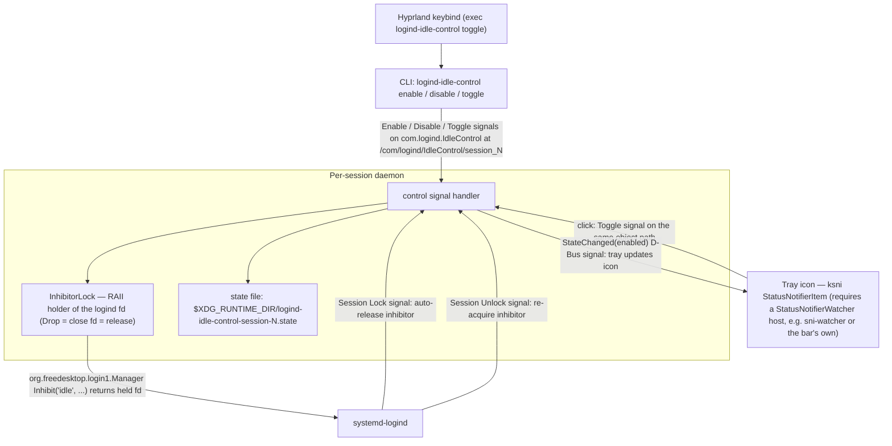

# logind-idle-control

A lightweight Rust daemon for managing systemd-logind idle inhibitor locks with per-session D-Bus event system.

## Documentation

📚 **[Wiki](https://github.com/MasonRhodesDev/logind-idle-control/wiki)** - Comprehensive guides and integration examples:
- [UI Integration](https://github.com/MasonRhodesDev/logind-idle-control/wiki/UI-Integration)
- [Custom D-Bus Consumers](https://github.com/MasonRhodesDev/logind-idle-control/wiki/Custom-D-Bus-Consumers)
- [Multi-Session Setup](https://github.com/MasonRhodesDev/logind-idle-control/wiki/Multi-Session-Setup)
- [Troubleshooting](https://github.com/MasonRhodesDev/logind-idle-control/wiki/Troubleshooting)

## Overview

`logind-idle-control` provides **per-GUI-session** idle inhibition control through systemd-logind's native D-Bus API. Each graphical session (TTY) gets its own isolated daemon instance.

**Key Features:**
- 🎯 **Per-session isolation** - Each GUI session (TTY) has independent control
- ✨ Native systemd-logind integration via D-Bus
- 📡 Event-driven D-Bus interface - consumers listen to signals directly
- 💾 Session-specific persistent state
- 🔒 Auto-disable on screen lock (configurable, listens to logind Lock signal)
- 🎨 Pure D-Bus interface - UI consumers listen directly, no wrapper scripts

## Session Isolation

**Critical Design:** Each graphical session runs its own daemon instance:

```
TTY1 (Session 2):  /com/logind/IdleControl/session_2
                   → State: enabled
                   → Inhibitor: active

TTY2 (Session 3):  /com/logind/IdleControl/session_3  
                   → State: disabled
                   → Inhibitor: inactive
```

Sessions don't interfere with each other.

## D-Bus Interface (Per-Session)

### Service Information
- **Service**: `com.logind.IdleControl` (shared session bus)
- **Object Path**: `/com/logind/IdleControl/session_<SESSION_ID>`
- **Interface**: `com.logind.IdleControl`

### Control Signals (Emit to daemon)

| Signal | Description |
|--------|-------------|
| `Enable` | Enable idle inhibitor for this session |
| `Disable` | Disable idle inhibitor for this session |
| `Toggle` | Toggle idle inhibitor state for this session |

### State Signals (Emitted by daemon)

| Signal | Parameters | Description |
|--------|------------|-------------|
| `StateChanged` | `boolean enabled` | Emitted when inhibitor state changes |

## Installation

### Arch Linux

Add the `[mason]` repo to `/etc/pacman.conf`:

```ini
[mason]
# Import the signing key first: https://github.com/MasonRhodesDev/arch-repo#use-it
SigLevel = Required DatabaseRequired
Server = https://masonrhodesdev.github.io/arch-repo/x86_64
```

```bash
sudo pacman -Syu logind-idle-control
```

### Fedora (COPR)

```bash
sudo dnf copr enable solaris765/logind-idle-control
sudo dnf install logind-idle-control
```

### From source (dev fallback)

```bash
make            # builds daemon + tray
sudo make install   # DESTDIR/PREFIX-correct; default PREFIX=/usr/local
```

### After installing

The package ships both user units and the tray icons; enable per user:

```bash
systemctl --user enable --now logind-idle-control.service
systemctl --user enable --now logind-idle-control-tray.service   # optional
```

The tray is optional and requires an SNI-compatible tray host that provides `org.kde.StatusNotifierWatcher` on the session bus. If the watcher is not available during login, the tray service waits for it instead of restart-looping.

## CLI Usage

The CLI automatically detects which graphical session you're in:

```bash
logind-idle-control enable   # Enable idle inhibitor
logind-idle-control disable  # Disable idle inhibitor
logind-idle-control toggle   # Toggle state
logind-idle-control status   # Check current status
logind-idle-control monitor  # Monitor state changes via D-Bus
logind-idle-control daemon   # Run daemon (typically started by systemd)
```

## Configuration

Config file: `~/.config/logind-idle-control/config.toml`

```toml
state_on_start = false    # Enable inhibitor when daemon starts
disable_on_lock = true    # Auto-disable when screen locked
log_level = "info"        # Logging verbosity
```

## UI Integration

UI applications can monitor idle inhibitor state via D-Bus signals directly.

 

The bundled tray icon in Waybar: inhibitor enabled (full cup) vs disabled (crossed-out cup).

### D-Bus Integration Pattern

Your UI module should:
1. Detect current session ID via `loginctl`
2. Connect to session-specific D-Bus path
3. Listen for `StateChanged` signals
4. Read initial state from: `$XDG_RUNTIME_DIR/logind-idle-control-session-<ID>.state`

### Example D-Bus Listener (pseudocode)

```
session_id = get_session_id()
object_path = "/com/logind/IdleControl/session_" + session_id

# Read initial state
state_file = "$XDG_RUNTIME_DIR/logind-idle-control-session-{session_id}.state"
display_icon(read(state_file))

# Listen for changes
dbus_monitor("com.logind.IdleControl", object_path, "StateChanged", callback)
```

### Minimal Shell Script Example

```bash
#!/bin/bash
SESSION=$(loginctl session-status | head -1 | awk '{print $1}')
STATE_FILE="$XDG_RUNTIME_DIR/logind-idle-control-session-${SESSION}.state"

if [[ -f "$STATE_FILE" ]] && [[ "$(cat $STATE_FILE)" == "1" ]]; then
    echo "enabled"
else
    echo "disabled"
fi
```

For real-time updates, use the `monitor` command or listen to D-Bus `StateChanged` signals directly.

## State Files (Per-Session)

```
$XDG_RUNTIME_DIR/logind-idle-control-session-2.state  # Session 2
$XDG_RUNTIME_DIR/logind-idle-control-session-3.state  # Session 3
```

## Integration Examples

### Lock Screen

```bash
#!/bin/bash
logind-idle-control disable
hyprlock
```

The daemon auto-disables on lock if `disable_on_lock = true`.

### Hyprland Keybind

```
bind = $mainMod, I, exec, logind-idle-control toggle
```

### Multi-Session Example

```bash
# TTY1
$ loginctl session-status
2 - user (1000)
$ logind-idle-control enable
Idle inhibitor enabled

# TTY2 (same user, different session)
$ loginctl session-status
3 - user (1000)
$ logind-idle-control status
0  # Independent!
```

## Verification

```bash
# Check daemon
systemctl --user status logind-idle-control.service

# Check tray service
systemctl --user status logind-idle-control-tray.service

# Check session
loginctl session-status | head -1

# Check inhibitor lock
systemd-inhibit --list | grep logind-idle-control

# Monitor D-Bus
SESSION=$(loginctl session-status | head -1 | awk '{print $1}')
dbus-monitor --session "path='/com/logind/IdleControl/session_${SESSION}'"

# Check state file
cat $XDG_RUNTIME_DIR/logind-idle-control-session-${SESSION}.state

# Follow tray logs
journalctl --user -u logind-idle-control-tray.service -f
```

## Architecture



```
TTY1 (Session 2):
  systemd graphical-session.target
  → Starts logind-idle-control daemon instance 1
  → Detects session 2 via GetSessionByPID()
  → Creates D-Bus path: /com/logind/IdleControl/session_2
  → State file: .../session-2.state
  → Listens: /org/freedesktop/login1/session/_32

TTY2 (Session 3):
  systemd graphical-session.target
  → Starts logind-idle-control daemon instance 2
  → Detects session 3 via GetSessionByPID()
  → Creates D-Bus path: /com/logind/IdleControl/session_3
  → State file: .../session-3.state
  → Listens: /org/freedesktop/login1/session/_33

Both instances run independently on the same session D-Bus.
```

## How It Works

### Session Detection
1. Daemon calls `org.freedesktop.login1.Manager.GetSessionByPID()`
2. Verifies session type is `x11` or `wayland` (rejects TTY/SSH)
3. Uses session ID for all paths

### Native systemd-logind
1. Daemon calls `org.freedesktop.login1.Manager.Inhibit("idle", ...)`
2. logind returns file descriptor (FD)
3. FD held open = inhibitor active
4. FD closed = inhibitor released (automatic cleanup)

### Lock Detection
When `disable_on_lock = true`, daemon listens to session-specific `org.freedesktop.login1.Session.Lock` signal and disables inhibitor **before** lock screen appears.

## Troubleshooting

### Daemon won't start
```bash
journalctl --user -u logind-idle-control.service -f
loginctl session-status  # Must show Type: x11 or wayland
```

### Tray waits for a host
The tray binary requires an SNI-compatible tray host that owns `org.kde.StatusNotifierWatcher`. On login, the tray service may start before the watcher exists. That is now expected: the process stays alive and waits locally until the watcher appears.

Expected tray log messages:

- `StatusNotifierWatcher not available yet; waiting for tray host`
- `StatusNotifierWatcher detected; registering tray icon`
- `Tray icon registered`

If the watcher disappears during registration, the tray retries and logs:

- `Tray registration raced with watcher disappearance; retrying`

For actual tray startup failures unrelated to watcher availability, inspect:

```bash
systemctl --user status logind-idle-control-tray.service
journalctl --user -u logind-idle-control-tray.service -f
```

### Session detection issues
```bash
loginctl show-session $(loginctl session-status | head -1 | awk '{print $1}') -p Type
# Must be x11 or wayland, not tty
```

### D-Bus debugging
```bash
SESSION=$(loginctl session-status | head -1 | awk '{print $1}')
dbus-monitor --session "interface='com.logind.IdleControl'"
```

## License

MIT

## See Also

- [systemd Inhibitor Locks](https://systemd.io/INHIBITOR_LOCKS/)
- [org.freedesktop.login1](https://www.freedesktop.org/software/systemd/man/latest/org.freedesktop.login1.html)
- [hypridle](https://github.com/hyprwm/hypridle)
- [schema-tui](https://github.com/MasonRhodesDev/schema-tui)
